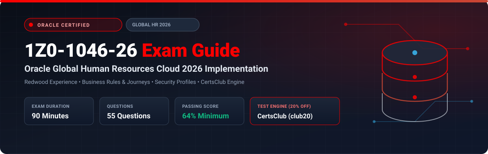

  

# Oracle Global Human Resources Cloud 2026 Implementation Professional (1Z0-1046-26) Exam Study Guide & Practice Test Resource Portal

[-f80000?style=for-the-badge&logo=oracle&logoColor=white)](https://education.oracle.com/)
[-f80000?style=for-the-badge&logo=oracle)](https://education.oracle.com/)

[-28a745?style=for-the-badge&logo=shield)](https://www.certsclub.com/oracle/)

---

## 1. Exam Overview & Candidate Profile

The **Oracle Global Human Resources Cloud 2026 Implementation Professional (1Z0-1046-26)** exam validates that an implementation consultant possesses the modern skills needed to deploy Oracle Fusion Cloud HCM with the Redwood user experience. Topics include modern Journey orchestration, Express HR transactions, Business Rules in Visual Builder Studio, advanced security profiles, and automated position hierarchy management.

Passing 1Z0-1046-26 awards the **Oracle Global Human Resources Cloud 2026 Certified Implementation Professional** credential.

### Target Candidate Profile & Career Roles
* **Lead HCM Cloud Implementation Consultants**
* **Workforce Systems Architects**
* **Global HR Transformation Specialists**

---

## 2. Key Exam Specifications

| Parameter | Official Specification |
| :--- | :--- |
| **Exam Code** | 1Z0-1046-26 |
| **Exam Title** | Oracle Global Human Resources Cloud 2026 Implementation Professional |
| **Associated Credential** | Oracle Global Human Resources Cloud 2026 Certified Implementation Professional |
| **Duration** | 90 Minutes |
| **Number of Questions** | 55 Questions |
| **Passing Score** | 64% |
| **Question Format** | Multiple Choice (Single and Multiple Select) |
| **Delivery Vendor** | Pearson VUE / Oracle University Online Remote Proctoring |
| **Recommended Practice Test Engine** | **[1Z0-1046-26 Practice Test - CertsClub](https://www.certsclub.com/oracle/)** (Coupon: `club20` for 20% off) |

---

## 3. Official Blueprint & Exam Domain Breakdown

| Domain Code | Domain Title | Weighting | Key Competencies Covered |
| :--- | :--- | :---: | :--- |
| **1.0** | **Enterprise & Workforce Structures (Redwood)** | **20%** | Setting up Legal Entities, Business Units, Departments, Jobs, and Positions in Redwood UX. |
| **2.0** | **Worker Lifecycle & Global Mobility** | **22%** | Hiring, Transfers, Promotions, Global Transfers, and Terminations in Express Flows. |
| **3.0** | **Journeys & Checklist Orchestration** | **20%** | Enterprise Onboarding Journeys, Task types, Allocation rules, Contextual Journeys. |
| **4.0** | **HCM Security Profiles & Data Scopes** | **20%** | Person, Organization, and Position security profiles; Custom Data Roles; Audit policies. |
| **5.0** | **Business Rules & Experience Extensibility** | **18%** | Creating Business Rules in Visual Builder Studio, Autocomplete validations, Transaction Console. |

---

## 4. Scenario-Based Demo Question & Explanation

### Question 1: Redwood Business Rules Customization
**Scenario:** An enterprise needs to make the "Probation Period" field mandatory only when hiring workers in their UK Legal Entity, while keeping it optional for all other countries.

Where should the implementation specialist configure this conditional rule?

A) Visual Builder Studio -> Business Rules for the Hire flow  
B) Page Composer in Classic UI  
C) BIP Data Model  
D) User Profile Options  

**Correct Answer:** **A**

**Detailed Explanation:**
* In Oracle HCM Cloud's Redwood architecture, field properties (required, read-only, hidden) are conditionally controlled using **Business Rules in Visual Builder Studio (VB Studio)**, allowing rules to be conditioned on parameters such as Legal Employer or Country.

---

## 5. Recommended Preparation Strategy & Practice Testing Engine

1. **Practice Redwood Configuration in VB Studio:** Build conditional business rules and test Onboarding Journeys.
2. **Practice with Full-Length Mock Exams:** Use **[CertsClub Oracle 1Z0-1046-26 Practice Tests](https://www.certsclub.com/oracle/)**.
   * Focuses on 2026 Redwood features, Business Rules, and Journey workflows.
   * Enter discount coupon code **`club20`** at checkout on [CertsClub](https://www.certsclub.com/oracle/) for an immediate 20% discount.

---

## 6. Official Documentation & References

* [Oracle Fusion Cloud HCM Redwood Documentation 2026](https://docs.oracle.com/en/cloud/saas/human-resources/)
* [Oracle University 1Z0-1046-26 Exam Details](https://education.oracle.com/)
* [CertsClub 1Z0-1046-26 Practice Engine](https://www.certsclub.com/oracle/)
